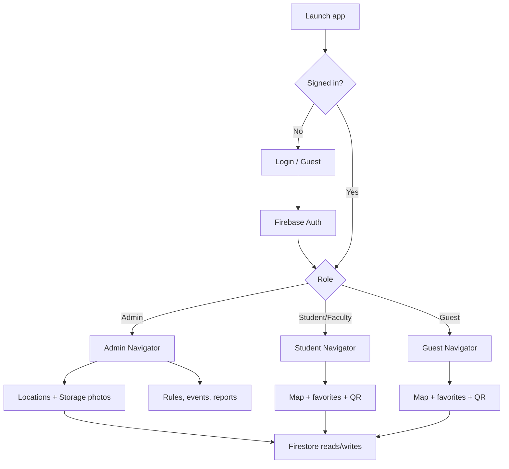

# RMU Campus Navigation

React Native (Expo) mobile app for **Regional Maritime University (RMU)** campus navigation. Students, faculty, guests, and admins can browse an interactive campus map, search locations, save favorites, scan QR codes, view campus updates, and manage campus data through Firebase.

This document covers **what the app does**, **recent implementation work**, and **how to set up the project** after pulling the repository.

---

## Table of contents

1. [Features by role](#features-by-role)
2. [Recent work completed](#recent-work-completed)
3. [Tech stack](#tech-stack)
4. [Prerequisites](#prerequisites)
5. [Project setup](#project-setup)
6. [Firebase setup](#firebase-setup)
7. [Google Maps API](#google-maps-api)
8. [Deploy security rules](#deploy-security-rules)
9. [Running the app](#running-the-app)
10. [Project structure](#project-structure)
11. [Firestore collections](#firestore-collections)
12. [QR codes](#qr-codes)
13. [Testing checklist](#testing-checklist)
14. [Troubleshooting](#troubleshooting)
15. [Security notes](#security-notes)

---

## Features by role

### Student / Faculty
- Home dashboard with quick actions (map, search, favorites, notifications, QR scan)
- Interactive campus map with GPS, search, turn-by-turn routing (OSRM)
- Save **favorites** (heart icon on location details)
- Campus events, dining, amenities, rules, safety contacts
- Issue reporting with optional photos
- Push-style notification list with read/unread state

### Guest
- Anonymous Firebase session (guest login)
- Map, search, **favorites** (same Firestore `favourite` collection as signed-in users)
- QR scanner and location details
- Limited feature set vs student (no full notifications stack on tabs)

### Admin
- Dashboard with live counts
- CRUD: buildings, locations, dining, amenities, campus rules, reports
- Notifications and events with audience targeting
- **Location photos**: gallery/camera upload to Firebase Storage (or optional image URL)
- Excel/CSV bulk import for locations
- User management (create student/faculty accounts)
- Analytics export (PDF)

---

## Recent work completed

Use this section when reviewing the latest push.

### Favorites (full implementation)
- Firestore collection: `favourite` (`userId`, `locationId`, `createdAt`)
- Service functions: `subscribeToUserFavorites`, `toggleFavorite`, `removeFavorite` in `src/services/databaseService.js`
- **Favorites** tab wired for students and guests
- Heart button on **Location Details** screen
- Firestore rules for per-user read/create/delete

### Campus rules (student ↔ admin sync)
- Student **Campus Rules** screen reads from Firestore `rules` collection (admin-managed)
- Falls back to default guideline sections if no rules exist yet

### QR scanner
- Screen: `src/screens/common/QRScannerScreen.js`
- Registered in **Student** and **Guest** navigators
- Quick action on student home and guest home
- Payloads: `location:<firestoreId>` or `geo:<lat>,<lng>`

### Safety & support
- Emergency contacts moved to `CAMPUS_EMERGENCY_CONTACTS` in `src/utils/constants.js` (Ghana / RMU placeholders — **update with real numbers**)

### Firebase Storage (location photos)
- Admin **Add Locations** supports gallery/camera upload via `src/services/storageService.js`
- Images stored at `locations/{locationId}/{timestamp}.jpg`
- `imageurl` field on location documents
- Location details shows photo in header when `imageurl` is set
- `storage.rules` added (admin write, public read)

### Map screen UI polish
- Dark/light theme toggle on map (replaces non-functional mic button)
- **Details** button when a marker is selected
- Improved search suggestions (category + chevron)
- Status chips: navigation state, GPS, campus place count

### Firebase deploy tooling
- `firebase.json` — Firestore + Storage rules
- `firebase.rules` — includes `favourite` collection
- `storage.rules` — location image paths
- `.firebaserc.example` — template for project linking
- npm script: `npm run deploy:rules`

### UI / navigation refinements
- Student tab bar styling
- Favorites empty states and pull-to-refresh
- Guest navigator: Favorites tab + QR stack screen

---

## Tech stack

| Layer | Technology |
|--------|------------|
| UI | React 19, React Native 0.81, Expo 54 |
| Navigation | React Navigation 6 (stack + tabs) |
| Backend | Firebase Auth, Firestore, Storage |
| Map | Google Maps JavaScript API in WebView (`src/components/Map.js`) |
| Routing | OSRM public API (`router.project-osrm.org`) |
| Other | Expo Location, Camera, Image Picker, Document Picker, XLSX |

> **Note:** `react-native-maps` is listed as a dependency but the active map implementation uses a **WebView + Google Maps JS** approach. Web shows a simplified location list instead of the live map.

---

## Prerequisites

- **Node.js** 18+ and npm
- **Expo Go** on a physical device (recommended for map, camera, QR, GPS), or Android/iOS emulator
- A **Firebase project** with Auth, Firestore, and Storage enabled
- **Google Maps JavaScript API** key (for the in-app map WebView)
- **Firebase CLI** (optional, for deploying rules): `npm install -g firebase-tools`

---

## Project setup

### 1. Clone and install

```bash
git clone <repository-url>
cd CampusUpdate
npm install
```

### 2. Firebase configuration (required)

Credentials are **not** committed. Choose **one** of these options:

#### Option A — Local config file (recommended)

```bash
cp src/config/firebaseConfig.example.js src/config/firebaseConfig.local.js
```

Edit `src/config/firebaseConfig.local.js` with values from Firebase Console → Project settings → Your apps → Web app config.

#### Option B — Environment variables

```bash
cp .env.example .env.local
```

Fill in all `EXPO_PUBLIC_FIREBASE_*` variables. Ensure `firebaseConfig.local.js` reads from `process.env` (see example file) or wire env into your local config.

| Variable | Description |
|----------|-------------|
| `EXPO_PUBLIC_FIREBASE_API_KEY` | Web API key |
| `EXPO_PUBLIC_FIREBASE_AUTH_DOMAIN` | `project-id.firebaseapp.com` |
| `EXPO_PUBLIC_FIREBASE_PROJECT_ID` | Project ID |
| `EXPO_PUBLIC_FIREBASE_STORAGE_BUCKET` | `project-id.appspot.com` |
| `EXPO_PUBLIC_FIREBASE_MESSAGING_SENDER_ID` | Sender ID |
| `EXPO_PUBLIC_FIREBASE_APP_ID` | App ID |

### 3. Google Maps API key

Edit `src/config/googleMaps.js` or set:

```bash
GOOGLE_MAPS_API_KEY=your-key-here
```

Enable **Maps JavaScript API** in Google Cloud Console and restrict the key appropriately.

### 4. Admin user in Firestore

After first login, ensure an admin user document exists:

- Collection: `users`
- Document ID: Firebase Auth `uid`
- Field: `role` = `"admin"`

Or add your admin email to `isKnownAdminEmail()` in `firebase.rules` (development only).

---

## Firebase setup

### Console checklist

1. **Authentication** — enable Email/Password and **Anonymous** (for guest access).
2. **Firestore** — create database (production or test mode for development).
3. **Storage** — enable Firebase Storage (required for location photo uploads).
4. Create collections as you use the app, or seed via admin UI.

### Authentication methods

| Method | Used for |
|--------|----------|
| Email/password | Students, faculty, admin |
| Anonymous | Guest “Continue as guest” |

### First-time admin

1. Create user in Firebase Auth (or use admin “Manage People” after one admin exists).
2. Add `users/{uid}` with `role: "admin"`.
3. Log in on the app → Admin navigator loads.

See also: `FIREBASE_SETUP_GUIDE.md` for extended Firebase Console steps.

---

## Deploy security rules

Rules files in the repo:

| File | Purpose |
|------|---------|
| `firebase.rules` | Firestore (locations, favourites, reports, etc.) |
| `storage.rules` | Location images under `locations/` |
| `firebase.json` | CLI config for both |

### Link your Firebase project

```bash
cp .firebaserc.example .firebaserc
# Edit .firebaserc and set your project ID

firebase login
firebase use --add
```

Or deploy with an explicit project:

```bash
firebase deploy --only firestore:rules,storage --project YOUR_PROJECT_ID
```

Or use the npm script:

```bash
npm run deploy:rules
```

**Important:** Deploy rules before testing favorites, reports, or image uploads in production. Permission errors usually mean rules were not published or the user is not admin.

---

## Running the app

```bash
npx expo start
```

Then:

- Press `a` for Android emulator, `i` for iOS simulator, or scan the QR code with **Expo Go**.
- Map, GPS, camera, and QR work best on a **physical device**.

Other scripts:

```bash
npm run android   # expo start --android
npm run ios       # expo start --ios
npm run web       # expo start --web (limited map support)
```

### Login behavior

`FORCE_REQUIRE_LOGIN` in `src/utils/constants.js` is `true` by default — the app signs out on launch so users must log in (or use guest). Set to `false` only for local debugging if needed.

---

## Project structure

```
CampusUpdate/
├── App.js                      # Entry: providers + RootNavigator
├── firebase.json               # Rules deploy config
├── firebase.rules              # Firestore security rules
├── storage.rules               # Storage security rules
├── .env.example                # Env template (copy to .env.local)
├── .firebaserc.example         # Firebase CLI project template
├── FIREBASE_SETUP_GUIDE.md     # Extended Firebase guide
└── src/
    ├── components/             # Map, buttons, ScreenWrapper, etc.
    ├── config/                 # firebase.js, googleMaps.js
    ├── context/                # AuthContext, CampusUpdatesContext
    ├── navigation/             # Role-based navigators
    ├── screens/
    │   ├── admin/              # Admin CRUD screens
    │   ├── auth/               # Login
    │   ├── student/            # Student home, favorites, rules, etc.
    │   ├── guest/              # Guest home
    │   └── common/             # Map, search, location details, QR
    ├── services/
    │   ├── databaseService.js  # Firestore CRUD + subscriptions
    │   ├── mapService.js       # Coordinates, OSRM routing
    │   └── storageService.js   # Location image upload/delete
    └── utils/constants.js      # Colors, roles, emergency contacts
```

---

## Firestore collections

| Collection | Description |
|------------|-------------|
| `users` | Profiles, roles, notification reads, event interests |
| `buildings` | Campus buildings |
| `locations` | Places with coordinates, category, `imageurl` |
| `amenities` | Campus amenities |
| `dining` | Dining options |
| `notifications` | Campus announcements |
| `events` | Campus events |
| `rules` | Campus rules (admin writes, students read) |
| `reports` | Student/staff issue reports |
| `favourite` | User saved locations (`userId` + `locationId`) |

### Location document (example)

```json
{
  "names": "Engineering Block",
  "description": "Main engineering facility",
  "category": "Building",
  "coordinates": {
    "latitude": 5.607,
    "longitude": -0.172
  },
  "imageurl": "https://firebasestorage.googleapis.com/...",
  "createdBy": "<admin-uid>",
  "createdAt": "<timestamp>"
}
```

---

## QR codes

Generate QR codes (any generator) with these payloads:

| Format | Example | Behavior |
|--------|---------|----------|
| Location ID | `location:abc123FirestoreId` | Opens location details |
| Coordinates | `geo:5.607,-0.172` | Opens map centered on coords |

QR scanning requires a **mobile device** (not supported on web).

---

## Testing checklist

After setup, verify:

- [ ] Login as **student** — map loads, search works, GPS permission granted
- [ ] Open a location → tap **heart** → appears under **Favorites** tab
- [ ] **Guest** login → favorites and QR work
- [ ] **Admin** → Add Location with **Gallery/Camera** photo → image appears on location details
- [ ] Admin → Campus Rules → student **Campus Rules** updates live
- [ ] Deploy Firestore + Storage rules → no `permission-denied` on favorites/upload
- [ ] QR scan with `location:<id>` opens correct place

---

## Troubleshooting

| Problem | Likely fix |
|---------|------------|
| `Firebase configuration incomplete` | Create `firebaseConfig.local.js` or `.env.local` |
| `permission-denied` on favorites/reports | Run `npm run deploy:rules` |
| Image upload fails | Enable Storage; confirm admin `users/{uid}.role` is `admin` |
| Map blank / grey | Check Google Maps API key and billing |
| Guest favorites empty | Guest must complete anonymous sign-in (use Guest on login) |
| QR does nothing | Use Expo Go on phone; check payload format |
| Rules deploy: “No active project” | Copy `.firebaserc.example` → `.firebaserc` and set project ID |

---

## Security notes

- Do **not** commit `firebaseConfig.local.js`, `.env.local`, or API keys.
- Deploy `firebase.rules` and `storage.rules` before production.
- Replace placeholder emergency numbers in `src/utils/constants.js`.
- Restrict Google Maps and Firebase API keys in cloud consoles.
- Review `isKnownAdminEmail()` in `firebase.rules` — remove hardcoded emails for production.

---

## System flow (overview)



---

## Admin workflows (summary)

- Buildings, locations (with photos or URL), amenities, dining
- Campus rules, notifications, events (audience: everyone / staff / direct)
- Issue reports review and response
- Excel import: columns like name, latitude, longitude, description, category
- User creation (email/password + role)

---

## License / project context

Final-year project — **RMU Campus Navigation**. For internal team use; configure Firebase and API keys per environment before any public release.
