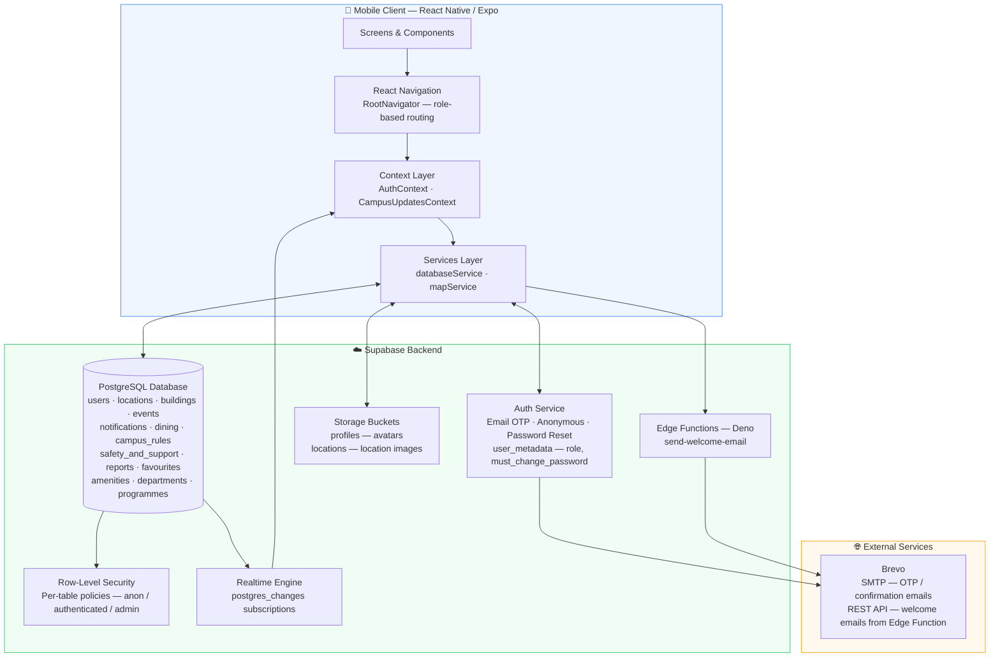
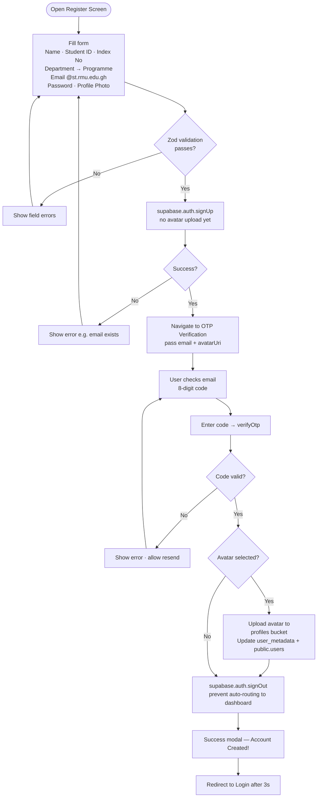
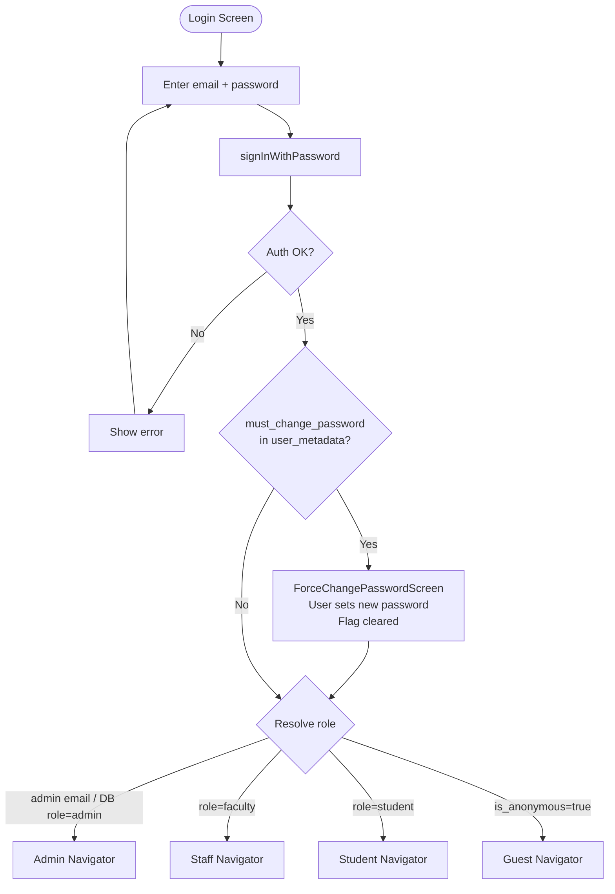
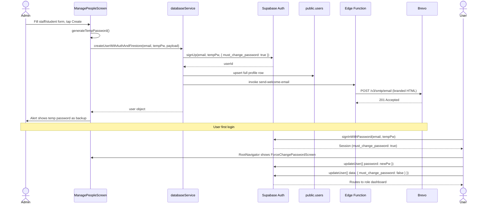
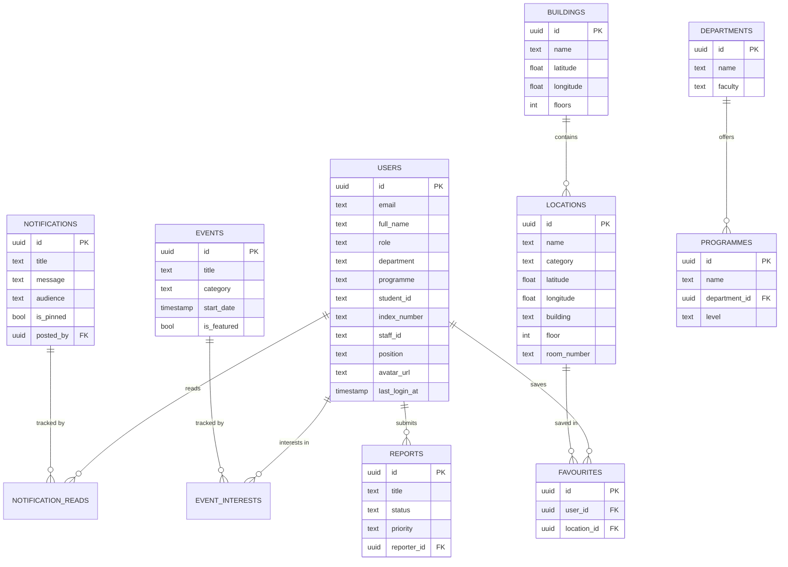
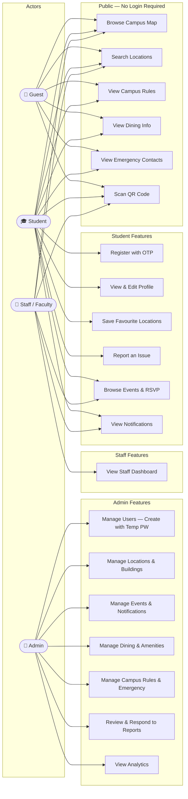
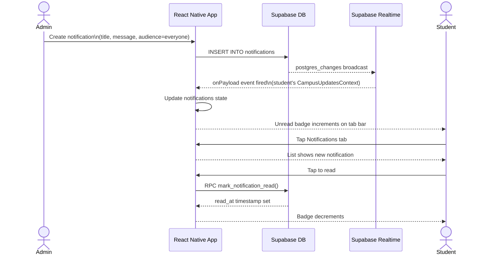
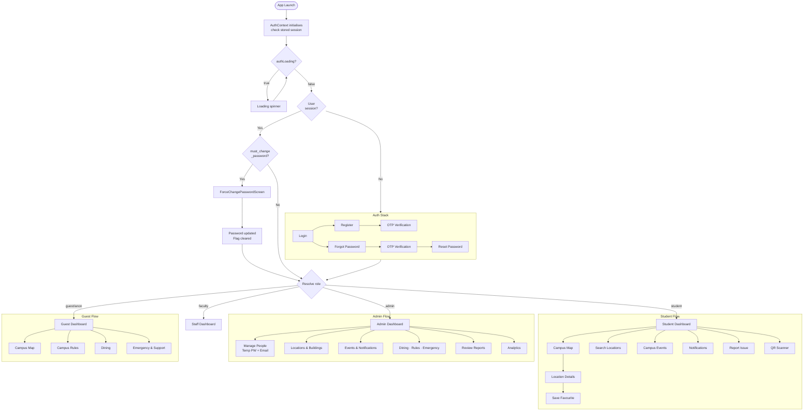

# RMU Campus Navigation App

A cross-platform mobile application built for **Regional Maritime University (RMU), Ghana**. The app provides an interactive campus map, role-based dashboards for students, staff, and administrators, and a guest browsing mode — all backed by a Supabase cloud backend.

> **Render diagrams** — open in VS Code with the Mermaid extension, or paste any block into [mermaid.live](https://mermaid.live).

---

## Table of Contents

1. [System Overview](#1-system-overview)
2. [Features by Role](#2-features-by-role)
3. [Tech Stack](#3-tech-stack)
4. [System Architecture](#4-system-architecture)
5. [Authentication Flows](#5-authentication-flows)
6. [Database Schema](#6-database-schema)
7. [Use Case Diagram](#7-use-case-diagram)
8. [Sequence Diagram](#8-sequence-diagram)
9. [Activity Diagram](#9-activity-diagram)
10. [Project Structure](#10-project-structure)
11. [Project Setup](#11-project-setup)
12. [Running the App](#12-running-the-app)
13. [Troubleshooting](#13-troubleshooting)

---

## 1. System Overview

The RMU Campus Navigation App serves four types of users through a single codebase:

| User Type | Access | How they enter |
|-----------|--------|----------------|
| **Guest** | Public campus info, map, dining, emergency contacts, campus rules | Tap "Continue as Guest" → anonymous Supabase sign-in |
| **Student** | All guest features + notifications, events, favourites, report issues, profile | Register with `@st.rmu.edu.gh` email → OTP verification |
| **Staff / Faculty** | All student features + staff dashboard | Admin-created account → temp password email → force change on first login |
| **Admin** | Full CRUD over all data, user management, analytics | Hardcoded email list or DB role = admin |

### Key System Behaviours

- **OTP-based email verification** — 8-digit code sent to student email on registration; must be entered before account is activated.
- **Guest mode** — anonymous Supabase session, no registration required. Accesses public data via RLS-`USING(true)` policies.
- **Temp-password flow** — when an admin creates a staff or student account, a secure 10-character password is auto-generated, emailed to the user via a Supabase Edge Function (Brevo API), and the `must_change_password` flag is set. The user is intercepted on first login and forced to set a new password before reaching their dashboard.
- **Role resolution** — after login, `AuthContext` resolves the user role from: (1) admin email list, (2) `user_metadata.role`, (3) `public.users.role` DB lookup. Anonymous sessions always resolve to `guest`.
- **Real-time updates** — notifications, events, and user lists use Supabase Realtime subscriptions (`postgres_changes`).
- **Avatar upload** — deferred to after OTP verification so `auth.uid()` is guaranteed to be set; uploaded to the `profiles` storage bucket.

---

## 2. Features by Role

### 👤 Guest
- Browse interactive campus map
- Search and view location details
- View campus rules (live from database)
- View dining & cafeterias (live from database)
- View emergency & support contacts (live from database)
- Scan QR codes to open location details
- Tap "Sign In" to transition to the Auth flow

### 🎓 Student
- All guest features
- Register with `@st.rmu.edu.gh` email + 8-digit OTP verification
- Upload a profile photo during registration
- Student home dashboard with quick-action cards
- Drawer sidebar navigation
- Save favourite locations (toggle heart)
- Browse campus events and express interest
- Real-time notifications with unread badge counter
- Dining & cafeteria listings
- Campus rules and student handbook
- Safety & support emergency contacts
- Submit and track issue reports (with photos)
- Scan QR codes → open location details

### 👔 Staff / Faculty
- Staff home dashboard
- All map and search features
- Real-time notifications
- Saved favourite locations
- Campus events

### 🔑 Admin
- Admin dashboard with live statistics (users, locations, buildings, events, reports)
- **Manage People** — create student & staff accounts (auto-generated temp password + welcome email), edit, delete
- **Manage Locations** — full CRUD, bulk Excel/CSV import, map pin preview
- **Manage Buildings** — full CRUD with coordinates and floor count
- **Manage Events** — create/edit/delete with featured flag and attendee count
- **Manage Notifications** — create with audience targeting (everyone / students / staff / direct), pin important ones
- **Manage Dining** — full CRUD for cafeterias and menus
- **Manage Amenities** — facilities with location coordinates
- **Manage Campus Rules** — severity-tagged rules (critical / warning / info)
- **Manage Emergency Contacts** — safety & support listings
- **Manage Departments** — department CRUD
- **Review Reports** — view, respond to, and update status of student issue reports
- **Analytics & Reports** — usage stats and export
- Campus content management (campus structure, control centre)

---

## 3. Tech Stack

| Layer | Technology | Purpose |
|-------|-----------|---------|
| **Framework** | React Native 0.81 + Expo SDK 54 | Cross-platform mobile (Android & iOS) |
| **Language** | JavaScript (React 19) | App logic and UI |
| **Navigation** | React Navigation 7 | Stack, Bottom Tabs, Drawer navigators |
| **Backend — Auth** | Supabase Auth | Email OTP, anonymous sign-in, password reset, session management |
| **Backend — Database** | Supabase PostgreSQL | All app data with Row-Level Security policies |
| **Backend — Realtime** | Supabase Realtime | Live notification/event updates via `postgres_changes` |
| **Backend — Storage** | Supabase Storage | Profile photos (`profiles` bucket), location images (`locations` bucket) |
| **Backend — Functions** | Supabase Edge Functions (Deno) | `send-welcome-email` — sends branded HTML welcome email with temp credentials |
| **Email Delivery** | Brevo (SMTP + REST API) | OTP confirmation emails + admin welcome emails |
| **Validation** | Zod | Schema validation for all forms |
| **Map** | react-native-maps + OpenStreetMap tiles | Interactive campus map with markers |
| **Icons** | HugeIcons (`@hugeicons/react-native`) + Ionicons | UI icons throughout |
| **Fonts** | Outfit via `@expo-google-fonts/outfit` | Typography (Regular, SemiBold, Bold, ExtraBold) |
| **Camera / Media** | Expo Image Picker, Expo Camera | Profile photo upload, QR scanning |
| **File Import** | Expo Document Picker + XLSX | Bulk location import from Excel |
| **State** | React Context API | Auth state, notifications/events, theme |

---

## 4. System Architecture



---

## 5. Authentication Flows

### Student Self-Registration



### Login + Role Routing



### Admin Creates Account (Temp Password Flow)



---

## 6. Database Schema

### Tables

| Table | Key Columns | Description |
|-------|-------------|-------------|
| `users` | `id`, `email`, `full_name`, `role`, `department`, `programme`, `student_id`, `index_number`, `staff_id`, `position`, `phone`, `avatar_url`, `last_login_at` | All user profiles — synced from `auth.users` via triggers |
| `buildings` | `id`, `name`, `description`, `latitude`, `longitude`, `floors`, `image_url` | Physical campus buildings |
| `locations` | `id`, `name`, `category`, `type`, `building`, `latitude`, `longitude`, `floor`, `room_number`, `image_urls[]`, `features[]`, `opening_hours` | Rooms, labs, offices and places within buildings |
| `departments` | `id`, `name`, `faculty`, `description`, `head_of_department`, `contact_email`, `availability_status` | Academic and administrative departments |
| `programmes` | `id`, `name`, `department_id`, `level`, `duration`, `is_active` | Degree programmes linked to departments |
| `notifications` | `id`, `title`, `message`, `category`, `audience`, `recipient_ids[]`, `posted_by`, `is_pinned` | Campus announcements with audience targeting |
| `notification_reads` | `id`, `user_id`, `notification_id`, `read_at` | Per-user read receipts |
| `events` | `id`, `title`, `description`, `location`, `category`, `start_date`, `end_date`, `organizer`, `is_featured`, `attendee_count` | Campus events |
| `event_interests` | `id`, `user_id`, `event_id` | User event RSVPs |
| `favourites` | `id`, `user_id`, `location_id` | User-saved locations |
| `dining` | `id`, `name`, `description`, `category`, `menu_items`, `operating_hours`, `location`, `image_url` | Campus cafeterias and food outlets |
| `amenities` | `id`, `name`, `category`, `type`, `icon_name`, `latitude`, `longitude`, `operating_hours` | Campus facilities (ATMs, gyms, etc.) |
| `campus_rules` | `id`, `title`, `description`, `category`, `severity`, `is_active` | Student handbook entries (critical / warning / info) |
| `safety_and_support` | `id`, `title`, `phone_number`, `category`, `is_available_24_7` | Emergency and support contacts |
| `reports` | `id`, `title`, `description`, `category`, `status`, `priority`, `reporter_id`, `photo_urls[]`, `admin_response`, `admin_read_at` | Student issue reports |

### RPC Functions

| Function | Description |
|----------|-------------|
| `toggle_favourite(p_location_id)` | Add or remove a favourite; returns `true` if added |
| `mark_notification_read(p_notification_id)` | Upsert a read-receipt row |
| `touch_user_login()` | Update `last_login_at` on the caller's user row |
| `check_email_exists(p_email)` | SECURITY DEFINER — lets anon callers check if an email is registered (used in forgot-password flow) |

### Entity Relationship Diagram



---

## 7. Use Case Diagram



---

## 8. Sequence Diagram

Real-time notification delivery from admin post to student badge update.



---

## 9. Activity Diagram

Full user lifecycle from app launch.



---

## 10. Project Structure

```
CampusMapApp/
├── App.js                             # Root: font loading, context providers, RootNavigator
├── app.json                           # Expo config
├── uml.md                             # Full UML diagram set (Mermaid)
├── database/
│   ├── schema.sql                     # All tables, RLS policies, triggers, functions
│   ├── programmes.sql                 # Departments + programmes seed data
│   └── verify_before_save.sql         # handle_new_user + handle_user_confirmed triggers
├── supabase/
│   └── functions/
│       └── send-welcome-email/
│           └── index.ts               # Deno Edge Function — Brevo REST API welcome email
└── src/
    ├── components/
    │   ├── OTPInputGroup.js            # 8-box OTP input (responsive sizing)
    │   ├── StudentSidebar.js           # Drawer sidebar with avatar + nav items
    │   ├── ScreenWrapper.js            # Safe area + status bar wrapper
    │   ├── InputField.js               # Reusable text input with label/error
    │   ├── LocationCard.js             # Map location card component
    │   └── Map.js / Map.web.js         # Platform-specific map component
    ├── config/
    │   └── supabase.js                 # Supabase client (persistSession:false, AsyncStorage)
    ├── context/
    │   ├── AuthContext.js              # Auth state, role resolution, OTP, guest mode,
    │   │                              #   mustChangePassword, clearMustChangePassword
    │   ├── CampusUpdatesContext.js     # Realtime notifications + events subscriptions
    │   └── ThemeContext.js
    ├── navigation/
    │   ├── RootNavigator.js            # Role-based root — intercepts mustChangePassword
    │   ├── AuthNavigator.js            # Login · Register · OTPVerification · ForgotPassword
    │   │                              #   · ResetPassword · EmailSent
    │   ├── StudentNavigator.js         # Drawer + Bottom Tabs (Home/Map/Favs/Notifs) + Stack
    │   ├── StaffNavigator.js           # Bottom Tabs (Home/Map/Alerts/Saved) + Stack
    │   ├── AdminNavigator.js           # Bottom Tabs + full admin screen stack
    │   └── GuestNavigator.js           # Bottom Tabs (Home/Map/Search/Favourites)
    ├── screens/
    │   ├── auth/
    │   │   ├── LoginScreen.js          # Email + password, white/blue theme
    │   │   ├── RegisterScreen.js       # Full student form: dept→prog dependency, avatar
    │   │   ├── OTPVerificationScreen.js# 8-digit OTP, avatar upload post-verify, success modal
    │   │   ├── ForgotPasswordScreen.js # Email check → OTP flow
    │   │   ├── ResetPasswordScreen.js  # New password after recovery OTP
    │   │   ├── EmailSentScreen.js
    │   │   └── ForceChangePasswordScreen.js  # Shown on first login for admin-created accounts
    │   ├── student/
    │   │   ├── StudentHomeScreen.js    # Dashboard with avatar, quick-action cards
    │   │   ├── FavoritesScreen.js
    │   │   ├── NotificationsScreen.js  # Real-time with read receipts
    │   │   ├── CampusEventsScreen.js
    │   │   ├── DiningScreen.js
    │   │   ├── CampusRulesScreen.js
    │   │   ├── SafetySupportScreen.js
    │   │   └── ReportIssueScreen.js    # Multi-photo issue submission
    │   ├── staff/
    │   │   └── StaffHomeScreen.js
    │   ├── admin/
    │   │   ├── AdminDashboard.js       # Live stats cards
    │   │   ├── ManagePeopleScreen.js   # Create student/staff with temp PW
    │   │   ├── ManageLocationsScreen.js
    │   │   ├── AddLocationsScreen.js   # Bulk Excel import
    │   │   ├── ManageBuildingsScreen.js
    │   │   ├── ManageEventsScreen.js
    │   │   ├── ManageNotificationsScreen.js
    │   │   ├── ManageDiningScreen.js
    │   │   ├── ManageAmenitiesScreen.js
    │   │   ├── ManageCampusRulesScreen.js
    │   │   ├── ManageEmergencyContactsScreen.js
    │   │   ├── ManageDepartmentsScreen.js
    │   │   ├── ManageReportsScreen.js
    │   │   ├── AdminAnalyticsScreen.js
    │   │   ├── AdminSettingsScreen.js
    │   │   ├── CampusStructureScreen.js
    │   │   ├── CampusContentScreen.js
    │   │   ├── ControlCentreScreen.js
    │   │   ├── EmergencyManagementScreen.js
    │   │   └── ReportsAnalyticsScreen.js
    │   ├── guest/
    │   │   ├── GuestHomeScreen.js      # 2×2 card grid, live DB previews, RMU branding
    │   │   ├── GuestCampusRulesScreen.js
    │   │   ├── GuestEmergencyScreen.js
    │   │   └── GuestDiningScreen.js
    │   └── common/
    │       ├── MapScreen.js            # Interactive map with markers from DB
    │       ├── SearchLocationsScreen.js
    │       ├── LocationDetailsScreen.js
    │       └── QRScannerScreen.js
    ├── services/
    │   ├── databaseService.js          # Supabase CRUD + realtime subscriptions
    │   │                              #   createUserWithAuthAndFirestore — temp PW + edge fn
    │   ├── mapService.js
    │   └── storageService.js
    └── utils/
        ├── theme.js                    # Colors, Outfit font variants, spacing, shadows
        ├── validationSchemas.js        # Zod schemas — login, register, OTP (8-digit), forgot
        └── constants.js               # USER_ROLES, COLORS, ENABLE_DEV_ADMIN_EMAIL_OVERRIDE
```

---

## 11. Project Setup

### 1. Clone and install

```bash
git clone https://github.com/Jlekan3/CampusUpdate.git
cd CampusUpdate
npm install
```

### 2. Environment variables

Create `.env.local` in the project root:

```env
EXPO_PUBLIC_SUPABASE_URL=https://your-project.supabase.co
EXPO_PUBLIC_SUPABASE_ANON_KEY=your-anon-key
```

### 3. Supabase database setup

Run these SQL files **in order** in the Supabase SQL Editor:

```
1. database/schema.sql            — tables, RLS, triggers, RPC functions
2. database/programmes.sql        — departments + programmes seed data
3. database/verify_before_save.sql — user-creation triggers
```

### 4. Supabase Auth configuration

In **Supabase Dashboard → Authentication → Email Templates**:

- **Confirm signup** template: replace `{{ .ConfirmationURL }}` with `{{ .Token }}`
- **Magic Link** template: same replacement (used for OTP resend)

This switches Supabase from sending a magic-link URL to sending the raw 8-digit OTP code.

### 5. Brevo SMTP (for OTP emails)

In **Supabase Dashboard → Settings → Auth → SMTP**:

| Field | Value |
|-------|-------|
| Host | `smtp-relay.brevo.com` |
| Port | `587` |
| Username | Your Brevo account email |
| Password | Brevo **SMTP key** (not account password — found under SMTP & API → SMTP Keys) |
| Sender email | `noreply@rmu.edu.gh` |

### 6. Deploy the welcome-email Edge Function

```bash
npx supabase login
npx supabase link --project-ref <your-project-ref>
npx supabase functions deploy send-welcome-email
npx supabase secrets set BREVO_API_KEY=<your-brevo-api-key>
```

> Get the Brevo API key from: Brevo Dashboard → **SMTP & API** → **API Keys** → Create API key.

### 7. Admin user setup

Add your email to `ADMIN_EMAILS` in `src/context/AuthContext.js`:

```js
const ADMIN_EMAILS = ['youremail@rmu.edu.gh'];
```

---

## 12. Running the App

```bash
npx expo start -c      # clear cache (recommended first run)
npx expo start         # normal start
```

| Key | Action |
|-----|--------|
| `a` | Open Android emulator |
| `i` | Open iOS simulator |
| Scan QR | Open in Expo Go on physical device |

> **QR scanning** and **camera features** require a physical device.

---

## 13. Troubleshooting

| Problem | Fix |
|---------|-----|
| Fonts not loading | `npx expo start -c` to clear Metro cache |
| Supabase `Invalid API key` | Check `.env.local` has correct `EXPO_PUBLIC_SUPABASE_URL` and `EXPO_PUBLIC_SUPABASE_ANON_KEY` |
| OTP email not arriving | Check Brevo SMTP config in Supabase Auth settings; check spam folder; verify email template uses `{{ .Token }}` not `{{ .ConfirmationURL }}` |
| `permission-denied` on DB query | Re-run `schema.sql`; check RLS policies — public tables need `USING(true)` for anon access |
| Programmes not loading in register | Run `programmes.sql` in Supabase SQL editor; check `departments` RLS allows anon SELECT |
| Map shows blank | Check OpenStreetMap tile URL in `MapScreen.js`; ensure device has internet |
| Avatar not showing after registration | Check `profiles` storage bucket exists and RLS allows authenticated insert |
| `map of undefined` in admin form | Ensure department is selected before programme (dept→prog dependency) |
| Welcome email not sent | Deploy Edge Function and set `BREVO_API_KEY` secret (see Setup step 6) |
| User not forced to change password | Confirm `must_change_password: true` is in `user_metadata` after admin creates account |
| `NAVIGATE 'Map' not handled` | Ensure `Stack.Screen name="Map"` exists in StudentNavigator and StaffNavigator |

---

## Security Notes

- Never commit `.env.local` or any API keys to version control.
- The Supabase **anon key** is safe to expose — all access is controlled by RLS policies.
- The `ADMIN_EMAILS` list in `AuthContext.js` is a dev-time override; for production, rely solely on the `role` column in `public.users`.
- The `check_email_exists` RPC is `SECURITY DEFINER` — review it before granting broad access.
- Profile photos use user-scoped paths (`userId/timestamp.ext`) enforced by storage RLS.

---

## Project Context

**Final-year capstone project** — Regional Maritime University, Nungua, Accra, Ghana.  
Built for internal university use. Configure Supabase credentials per environment before any public deployment.
