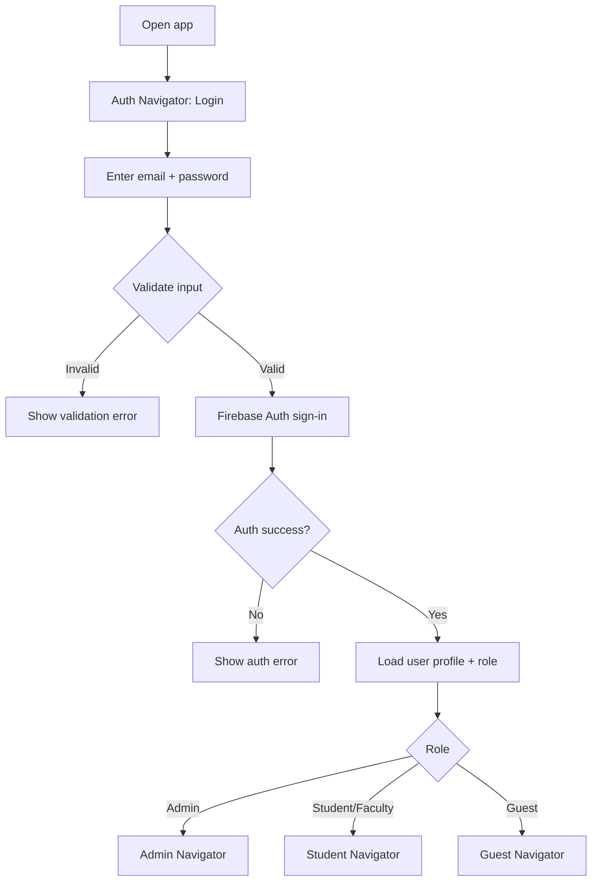
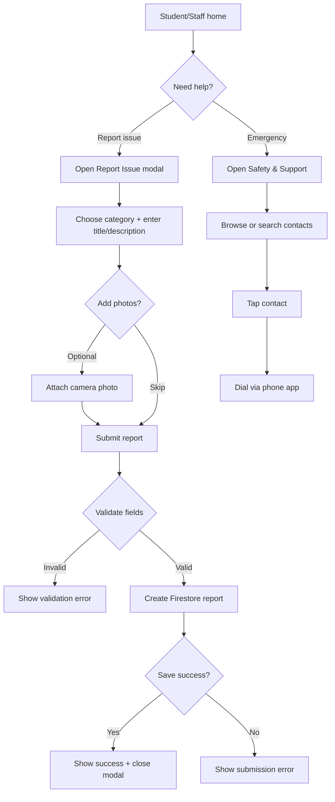
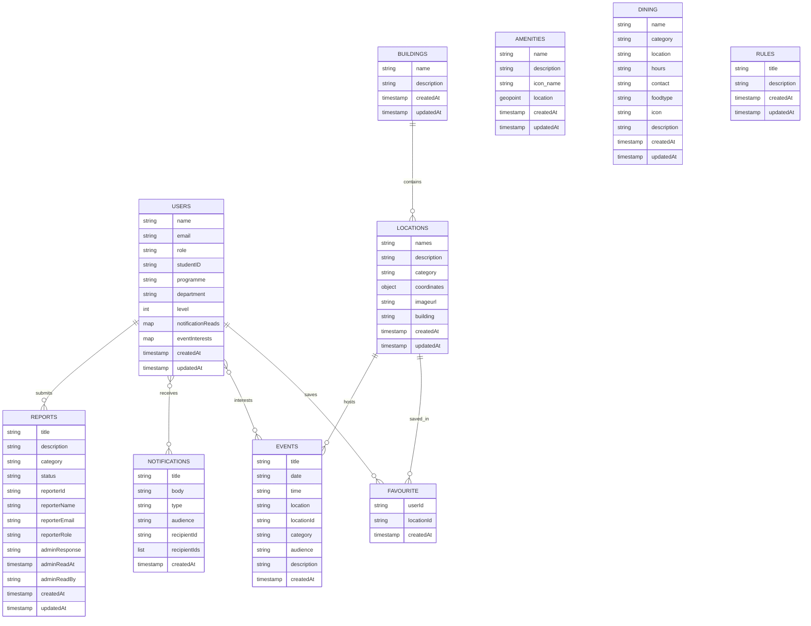

# RMU Campus Map

React Native (Expo) app for browsing RMU campus locations, viewing campus updates, scanning QR codes, and managing campus data with Firebase.

## Features
- Firebase Auth sign-in with role-based access
- Student, Faculty, Guest, and Admin experiences
- Interactive campus map and location details
- Search for locations and buildings
- QR scanning for quick navigation
- Admin management for buildings, locations, amenities, notifications, and events
- Real-time Firestore syncing for lists and updates
- Audience targeting for campus updates and events
- Excel import for locations

## System Flow
```mermaid
flowchart TD
  A[Launch app] --> B{Signed in?}
  B -- No --> C[Auth Navigator: Login]
  C --> D[Firebase Auth]
  D -->|Success| E{Role}
  B -- Yes --> E{Role}
  E -- Admin --> F[Admin Navigator]
  E -- Student/Faculty --> G[Student Navigator]
  E -- Guest --> H[Guest Navigator]

  F --> F1[Manage buildings/locations/amenities]
  F --> F2[Manage notifications/events]
  F --> F3[Import locations (Excel)]

  G --> G1[Map + search + favorites]
  G --> G2[Campus updates + events]
  G --> G3[QR scanner]

  H --> H1[Guest home + map]

  G1 --> I[Location details]
  G3 --> I

  F1 --> J[Firestore writes]
  F2 --> J
  F3 --> J
  G1 --> K[Firestore reads]
  G2 --> K
  H1 --> K
  I --> K

  J --> L[Realtime updates]
  K --> L
```

## Login Flow


## Issue & Emergency Flow


## Database Schema


## Tech Stack
- React Native + Expo
- React Navigation
- Firebase Auth and Firestore
- React Native Maps
- Expo Barcode Scanner, Document Picker, and File System
- XLSX for spreadsheet import

## Project Structure
- `App.js` - app entry and providers
- `src/components` - shared UI components
- `src/context` - auth and campus updates state
- `src/navigation` - role-based navigators
- `src/screens` - auth, admin, student, guest, and common screens
- `src/services` - Firebase helpers
- `firebase.rules` - Firestore security rules example

## Setup
1. Install dependencies:

```bash
npm install
```

2. Add your Firebase config in `src/config/firebase.js`.

3. Start Expo:

```bash
npx expo start
```

## Firebase
The app uses Firestore for persistent campus data and Firebase Auth for authentication.

Example config:

```js
const firebaseConfig = {
  apiKey: '<YOUR_API_KEY>',
  authDomain: '<YOUR_AUTH_DOMAIN>',
  projectId: '<YOUR_PROJECT_ID>',
  storageBucket: '<YOUR_STORAGE_BUCKET>',
  messagingSenderId: '<YOUR_SENDER_ID>',
  appId: '<YOUR_APP_ID>',
};
```

## Firestore Collections
- `users`
- `buildings`
- `locations`
- `amenities`
- `dining`
- `notifications`
- `events`
- `rules`
- `reports`
- `favourite`

## Admin Workflows
The admin area currently supports:
- Add, edit, and delete buildings
- Add, edit, and delete locations
- Add, edit, and delete amenities
- Create campus notifications with audience targeting
- Create events with audience targeting
- Import locations from Excel

## Access Control
Client-side:
- Admin-only screens are shown through the admin navigator
- Non-admin users are blocked from admin actions

Server-side:
- Firestore rules should be deployed before production
- Admin-only writes are protected in `firebase.rules`

Deploy rules with:

```bash
firebase deploy --only firestore:rules
```

## Notes
- Location data is streamed from Firestore in real time
- Current location entries can be edited or deleted from the admin UI
- Campus updates can target `Everyone` or `Staff only`
- Events also support audience targeting and Firestore-backed locations

## Security Checklist
- Verify Firestore rules before release
- Restrict admin writes to trusted users only
- Review any role-inference or dev overrides before production