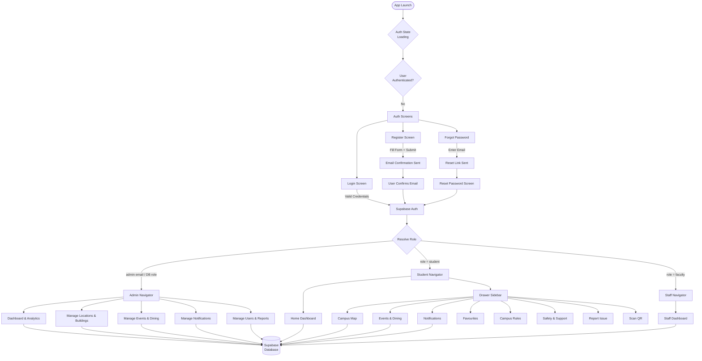
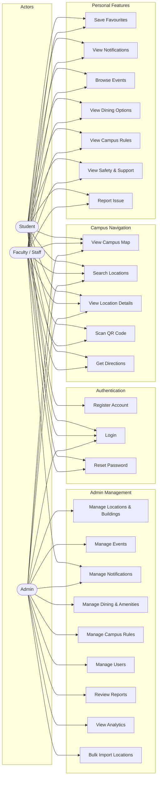
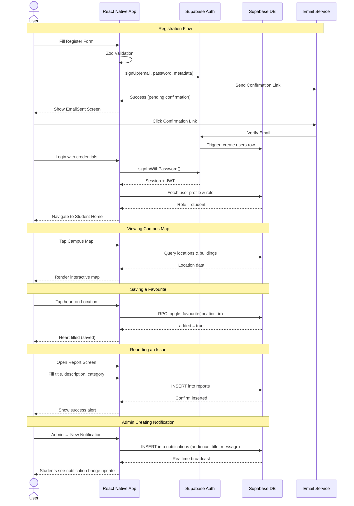
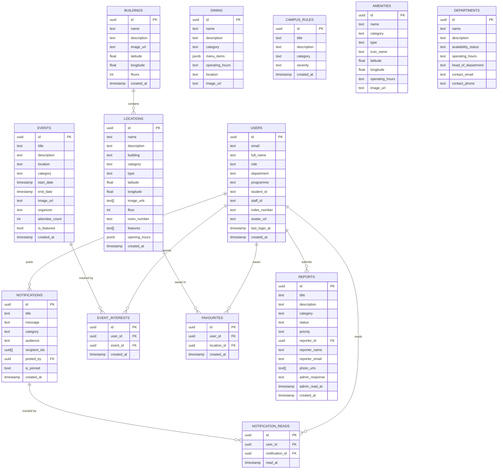
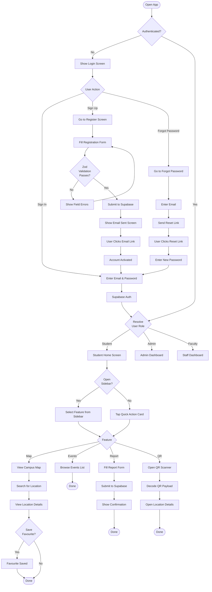
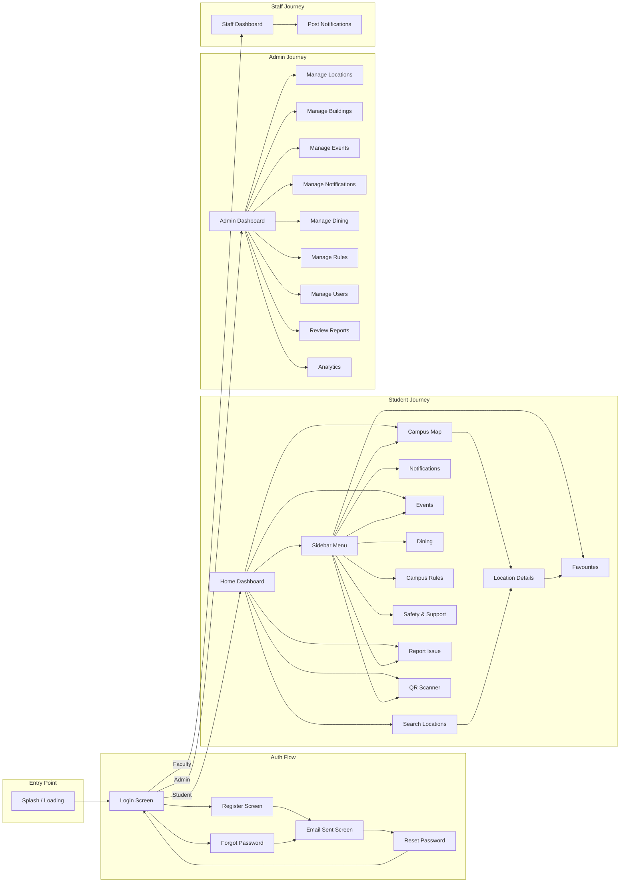

# RMU Campus Navigation

React Native (Expo) mobile app for **Regional Maritime University (RMU)** campus navigation. Students, faculty, and admins can browse an interactive campus map, search locations, save favourites, scan QR codes, view campus updates, register accounts, and manage campus data through Supabase.

---

## Table of Contents

1. [System Diagrams](#system-diagrams)
   - [System Flowchart](#1-system-flowchart)
   - [Use Case Diagram](#2-use-case-diagram)
   - [Sequence Diagram](#3-system-sequence-diagram)
   - [Entity Relationship Diagram](#4-entity-relationship-diagram)
   - [Activity Diagram](#5-activity-diagram)
   - [User Flow Diagram](#6-user-flow-diagram)
2. [Features by Role](#features-by-role)
3. [Tech Stack](#tech-stack)
4. [Project Setup](#project-setup)
5. [Project Structure](#project-structure)
6. [Database Schema](#database-schema)
7. [QR Codes](#qr-codes)
8. [Running the App](#running-the-app)
9. [Troubleshooting](#troubleshooting)

---

## System Diagrams

### 1. System Flowchart

Shows the high-level flow of the entire application from launch through role-based navigation to feature access.



---

### 2. Use Case Diagram

Shows the actors and the system features each can access.



---

### 3. System Sequence Diagram

Illustrates the interactions between the user, app, and Supabase backend for the key flows.



---

### 4. Entity Relationship Diagram

Shows the database tables in Supabase and their relationships.



---

### 5. Activity Diagram

Shows the step-by-step activities a student performs from opening the app to completing a task.



---

### 6. User Flow Diagram

Shows the complete journey of each user type through the application screens.



---

## Features by Role

### Student
- Home dashboard with quick access cards and upcoming events
- Interactive campus map with GPS and location search
- Drawer sidebar navigation to all campus features
- Save favourite locations
- Browse events, dining options, campus rules
- Safety & support contacts
- Submit issue reports
- Scan QR codes to open location details
- Real-time notifications with unread badge

### Faculty / Staff
- All student features
- Post campus-wide notifications

### Admin
- Dashboard with live statistics
- Full CRUD: locations, buildings, dining, amenities, campus rules
- Create and manage events and notifications (audience targeting)
- Review and respond to student issue reports
- User management (create student/faculty accounts)
- Bulk import locations from Excel/CSV
- Analytics export (PDF)

---

## Tech Stack

| Layer | Technology |
|-------|-----------|
| Framework | React Native 0.81, Expo 54 |
| Language | JavaScript (React 19) |
| Navigation | React Navigation 7 (Stack, Bottom Tabs, Drawer) |
| Backend | Supabase (Auth, PostgreSQL, Realtime, Storage) |
| Validation | Zod |
| Icons | HugeIcons (`@hugeicons/react-native`) + Ionicons |
| Fonts | Outfit via `@expo-google-fonts/outfit` |
| Map | react-native-maps + OpenStreetMap |
| Other | Expo Location, Camera, Image Picker, Document Picker, XLSX |

---

## Project Setup

### 1. Clone and install

```bash
git clone https://github.com/Jlekan3/CampusUpdate.git
cd CampusUpdate
npm install
```

### 2. Environment variables

Copy the example env and fill in your Supabase credentials:

```bash
cp .env.example .env.local
```

| Variable | Description |
|----------|-------------|
| `EXPO_PUBLIC_SUPABASE_URL` | Your Supabase project URL |
| `EXPO_PUBLIC_SUPABASE_ANON_KEY` | Supabase anon/public key |
| `GOOGLE_MAPS_API_KEY` | Google Maps JavaScript API key |

### 3. Supabase setup

1. Create a project at [supabase.com](https://supabase.com)
2. Run `database/schema.sql` in the SQL editor to create all tables, RLS policies, triggers, and functions
3. Enable **Email** authentication in Auth settings
4. Enable **email confirmation** (users receive a confirmation link after registration)

### 4. Admin user

After running the schema, add your email to the `ADMIN_EMAILS` list in `src/context/AuthContext.js`:

```js
const ADMIN_EMAILS = ['youremail@rmu.edu.gh'];
```

---

## Project Structure

```
CampusUpdate/
├── App.js                          # Entry: font loading, providers, RootNavigator
├── app.json                        # Expo config (softwareKeyboardLayoutMode: resize)
├── database/
│   └── schema.sql                  # Full Supabase schema, RLS policies, triggers
└── src/
    ├── components/
    │   ├── FormInput.js             # Reusable text input with label + error
    │   ├── OTPInputGroup.js         # 6-box OTP input
    │   ├── StudentSidebar.js        # Drawer sidebar content
    │   ├── CustomButton.js
    │   ├── LocationCard.js
    │   └── Map.js / Map.web.js
    ├── config/
    │   └── supabase.js              # Supabase client
    ├── context/
    │   ├── AuthContext.js           # Auth state, role resolution, register/login/logout
    │   ├── CampusUpdatesContext.js  # Realtime notifications & events
    │   └── ThemeContext.js
    ├── navigation/
    │   ├── RootNavigator.js         # Role-based root routing
    │   ├── AuthNavigator.js         # Login, Register, ForgotPassword, ResetPassword, EmailSent
    │   ├── StudentNavigator.js      # Drawer + Bottom Tabs + Stack
    │   ├── StaffNavigator.js
    │   └── AdminNavigator.js
    ├── screens/
    │   ├── auth/
    │   │   ├── LoginScreen.js
    │   │   ├── RegisterScreen.js    # With programme dropdown
    │   │   ├── ForgotPasswordScreen.js
    │   │   ├── ResetPasswordScreen.js
    │   │   └── EmailSentScreen.js
    │   ├── student/
    │   │   ├── StudentHomeScreen.js # Dashboard with quick actions
    │   │   ├── FavoritesScreen.js
    │   │   ├── NotificationsScreen.js
    │   │   ├── CampusEventsScreen.js
    │   │   ├── DiningScreen.js
    │   │   ├── CampusRulesScreen.js
    │   │   ├── SafetySupportScreen.js
    │   │   └── ReportIssueScreen.js
    │   ├── admin/                   # Full admin CRUD screens
    │   └── common/
    │       ├── MapScreen.js
    │       ├── SearchLocationsScreen.js
    │       ├── LocationDetailsScreen.js
    │       └── QRScannerScreen.js
    ├── services/
    │   ├── databaseService.js       # Supabase CRUD + realtime subscriptions
    │   ├── mapService.js
    │   └── storageService.js
    └── utils/
        ├── theme.js                 # Colors, fonts (Outfit), radius, shadow constants
        ├── validationSchemas.js     # Zod schemas for all forms
        └── constants.js            # Roles, emergency contacts
```

---

## Database Schema

### Tables

| Table | Description |
|-------|-------------|
| `users` | User profiles, roles, index number, programme |
| `buildings` | Campus buildings with coordinates |
| `locations` | Rooms and places (linked to buildings) |
| `notifications` | Announcements with audience targeting |
| `notification_reads` | Per-user read receipts |
| `events` | Campus events |
| `event_interests` | User RSVPs |
| `favourites` | User-saved locations |
| `dining` | Cafés and restaurants |
| `campus_rules` | Student handbook entries |
| `amenities` | Campus facilities |
| `departments` | Staff departments with availability |
| `reports` | Student issue reports |

### RPC Functions

| Function | Description |
|----------|-------------|
| `toggle_favourite(location_id)` | Add/remove favourite, returns boolean |
| `mark_notification_read(notification_id)` | Mark as read |
| `toggle_event_interest(event_id)` | RSVP toggle |
| `touch_user_login()` | Update last_login_at |

---

## QR Codes

Generate QR codes with these payload formats:

| Format | Example | Behaviour |
|--------|---------|-----------|
| Location ID | `location:uuid-here` | Opens location details |
| Coordinates | `geo:5.607,-0.172` | Opens map centred on coords |

QR scanning requires a **physical mobile device**.

---

## Running the App

```bash
npx expo start -c      # start with cleared cache (recommended)
npx expo start         # normal start
```

| Key | Action |
|-----|--------|
| `a` | Open on Android emulator |
| `i` | Open on iOS simulator |
| Scan QR | Open in Expo Go on device |

---

## Troubleshooting

| Problem | Fix |
|---------|-----|
| Fonts not loading | Run `npx expo start -c` to clear Metro cache |
| `Invalid API key` on Supabase | Check `.env.local` has correct `EXPO_PUBLIC_SUPABASE_URL` and key |
| Inputs not tappable | Ensure `softwareKeyboardLayoutMode: "resize"` in `app.json` |
| Map blank | Check Google Maps API key in `src/config/googleMaps.js` |
| Registration email not arriving | Check Supabase Auth → Email settings; check spam folder |
| `permission-denied` | Verify Supabase RLS policies are applied (re-run `schema.sql`) |
| QR does nothing | Check payload format; physical device required |

---

## Security Notes

- Do **not** commit `.env.local` or any API keys.
- Replace placeholder emergency numbers in `src/utils/constants.js` with real RMU contacts.
- Restrict Supabase anon key usage via RLS policies (all implemented in `schema.sql`).
- Review `ADMIN_EMAILS` in `AuthContext.js` before production.

---

## License / Project Context

Final-year project — **RMU Campus Navigation** for Regional Maritime University, Ghana. For internal team use; configure Supabase credentials per environment before any public release.
