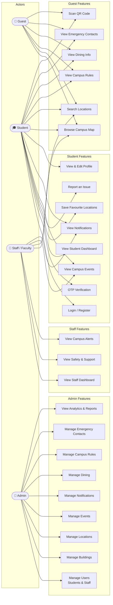
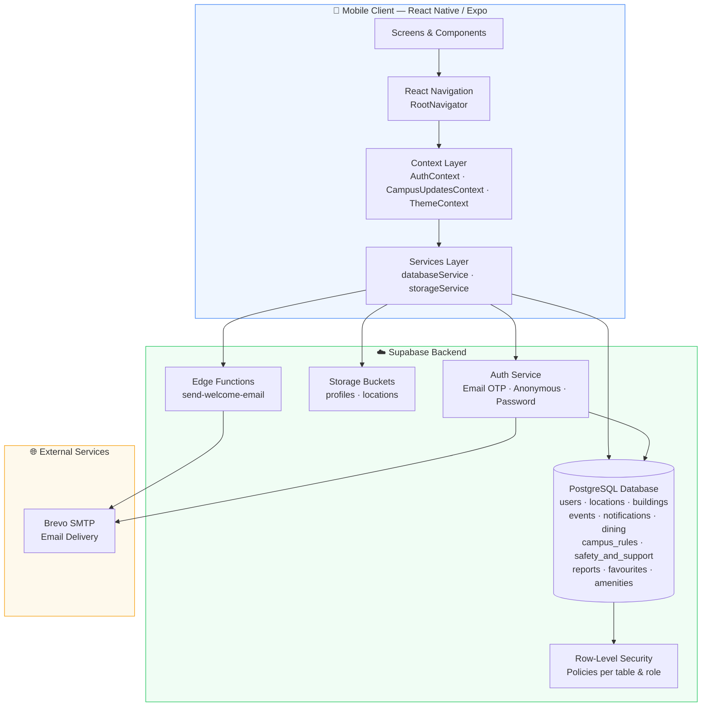
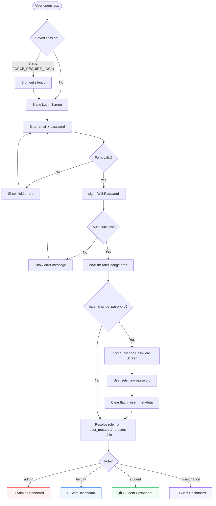
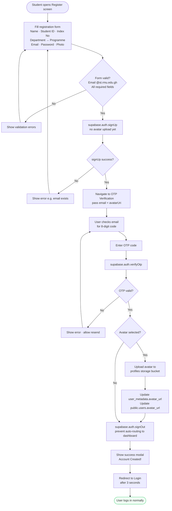
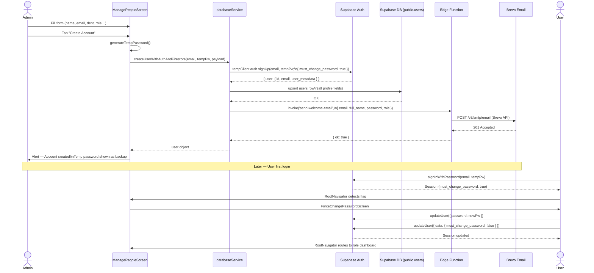
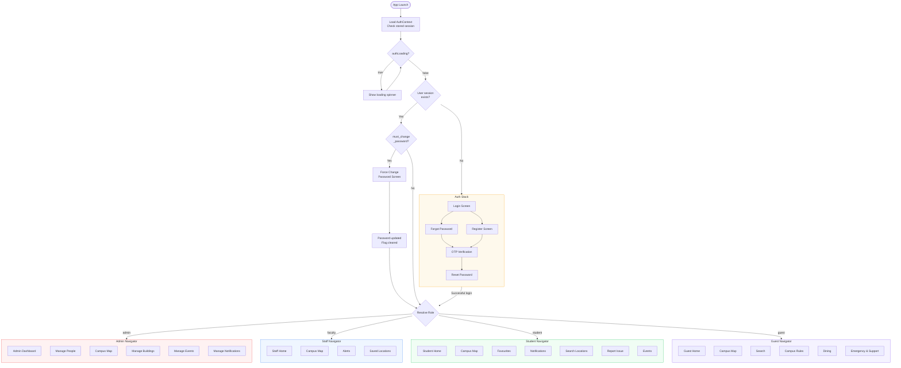

# RMU Campus Navigation App — UML Diagrams

> Render these diagrams in VS Code with the **Mermaid** extension, or paste any block into [mermaid.live](https://mermaid.live).

---

## 1. Use Case Diagram

---

## 2. System Architecture Flowchart

---

## 3. Login Flowchart

---

## 4. Registration Flow

---

## 5. Sequence Diagram — Admin Creates a New User

---

## 6. Activity Diagram — Full App Lifecycle

---

*Generated for: RMU Campus Navigation App · Regional Maritime University, Ghana*
